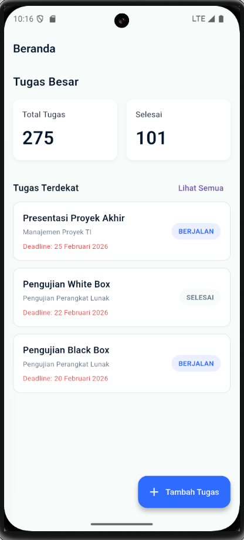

# COTS - Pemrograman Perangkat Bergerak (SE-07-01)

Aplikasi manajemen tugas kuliah ("Student Task Manager") yang dibangun menggunakan **Flutter** dan terintegrasi dengan **Supabase REST API**. Proyek ini dikerjakan untuk memenuhi tugas *Coding On The Spot* (COTS).

## 📱 Dokumentasi Aplikasi

Berikut adalah tampilan antarmuka aplikasi berdasarkan desain yang telah diimplementasikan:

| **1. Dashboard (Beranda)** | **2. Daftar Tugas (List)** |
|:---:|:---:|
|  |  |
| *Menampilkan ringkasan tugas dan tugas terdekat.* | *Fitur pencarian dan filter status (Semua, Berjalan, Selesai, Terlambat).* |

| **3. Detail Tugas** | **4. Tambah Tugas** |
|:---:|:---:|
|  |  |
| *Edit catatan, deadline logic, dan update status penyelesaian.* | *Form validasi input (tanpa angka pada judul) dan DatePicker.* |

> **Catatan:** Screenshot disimpan di folder `assets/screenshots/`.

---

## ✨ Fitur Utama

1.  **Dashboard Ringkas**: Menampilkan total tugas, jumlah selesai, dan 3 tugas prioritas terdekat.
2.  **Manajemen Tugas (CRUD)**:
    * **Create**: Menambah tugas baru dengan validasi input (Judul tidak boleh mengandung angka).
    * **Read**: Melihat daftar tugas dengan format tanggal Indonesia (contoh: 11 Januari 2026).
    * **Update**: Mengubah status (Selesai/Berjalan), mengedit catatan, dan logika otomatis "Terlambat" jika melewati deadline.
3.  **Pencarian & Filter**:
    * Cari tugas berdasarkan Judul atau Mata Kuliah.
    * Filter Tab: Semua, Berjalan, Selesai, Terlambat.
4.  **Integrasi API**: Terhubung langsung ke Supabase menggunakan HTTP Request.

---

## 🛠️ Teknologi yang Digunakan

* **Framework**: Flutter SDK
* **Language**: Dart
* **State Management**: `setState` & Controller Pattern
* **Networking**: `http` package
* **Formatting**: `intl` (Format Tanggal Indonesia)
* **Backend**: Supabase (REST API)

---

## 📂 Struktur Proyek

Struktur folder mengikuti ketentuan soal COTS:

```text
lib/
├── cots/
│   ├── config/             # Konfigurasi API (Base URL & Token)
│   ├── controllers/        # Logic penghubung UI dan Data
│   ├── design_system/      # Warna, Typography, dan Gaya Global
│   ├── models/             # Model Data (JSON Serialization)
│   ├── presentation/       
│   │   ├── pages/          # Halaman Utama (Dashboard, Add, List, Detail)
│   │   └── widgets/        # Komponen Reusable (Card, Input, Button)
│   └── services/           # HTTP Request Handler
└── main.dart               # Entry Point & Theme Configuration# COTS_PPB_2311104014_Farrel-Izaz
